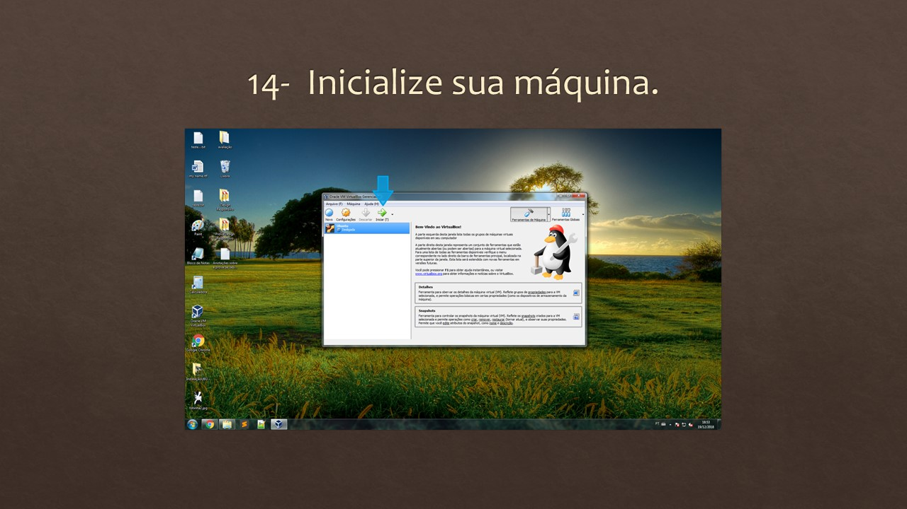
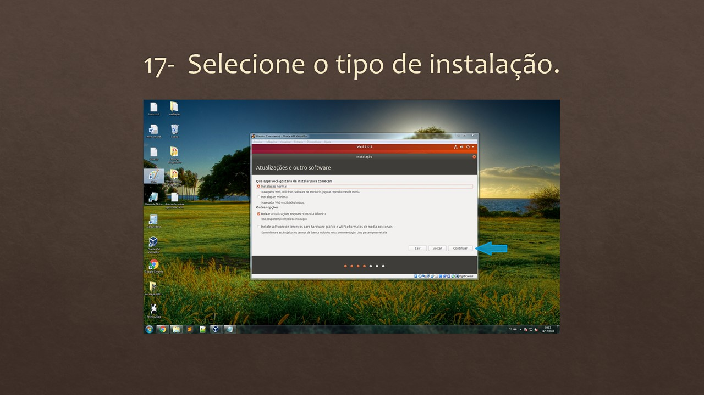

# Tutorial Linux

AVALIAÇÃO 4

Audacity

Audacity é um software livre de edição digital de áudio disponível principalmente nas plataformas: Windows, Linux e Mac e ainda em outros Sistemas Operacionais. O código fonte do Audacity está sob a licença GNU General Public License. A sua interface gráfica foi produzida utilizando-se de bibliotecas do wxWidgets. O Audacity começou em 1999 por Dominic Mazzoni e Roger Dannenberg na universidade norte-americana Carnegie Mellon University e foi lançado em 28 de maio de 2000 como versão 0.8.

O Audacity é muito popular entre os podcasters pelos seus recursos de edição, sua grande disponibilidade em múltiplas plataformas, suporte e licença aberta que permite ao programa ser gratuito.

Em 10 de outubro de 2011, ele era o 11º download mais popular do SourceForge, com 76,5 milhões de downloads. O Audacity ganhou o prêmio Community Choice Award do SourceForge em 2007 e 2009 na categoria Melhor Projeto Multimídia. Em março de 2015 a hospedagem foi movida para o FossHub e em 21 de fevereiro de 2017 ele excedeu 51,8 milhões de downloads nesta plataforma.

Para se utilizar o programa basta conectar seu microfone, seleciona-lo e pronto! Já estará disponível para captar seus áudios.
 
 
 
Pressionando o gravar iniciará a gravação.

Pressionando o stop cessará a gravação.

Pressionando o play poderá ouvir o áudio já gravado.

Indo em effects você conseguirá adicionar efeitos ao seu arquivo se áudio como: reverberação, compressão, redução de ruído entre outros.

